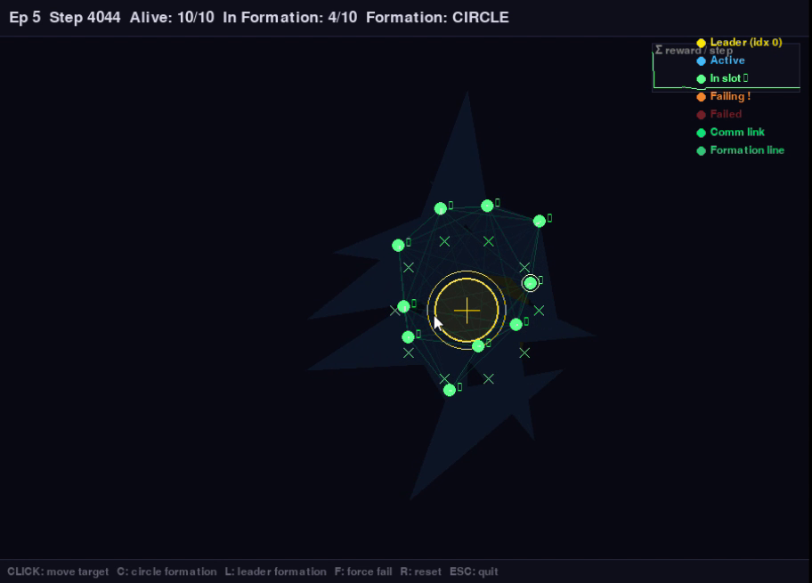
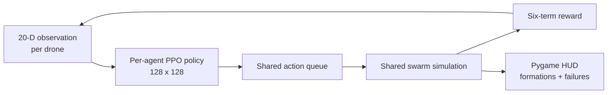

# Swarm Drone Simulation - IAS Project

Interactive 2D swarm simulator with a classical Boids baseline and an
experimental multi-agent PPO control stack.


## Evidence at a glance

| Verified configuration | Value |
| --- | ---: |
| Classical Boids demonstration | **30 drones** |
| Experimental PPO controllers | **10 agents** |
| Per-agent observation | **20 values** |
| Continuous action | **2 values** |
| Nearest neighbours observed | **3** |
| Maximum episode length | **800 steps** |

## Preview



The screenshot is extracted from the matching local formation-demo recording
and shows the actual simulator HUD.

## What it does

- Demonstrates separation, alignment, and cohesion with a 30-drone Boids mode.
- Switches between swarm, circle, and leader-follower formations at runtime.
- Simulates random failures, mouse-directed targets, boundaries, and a live HUD.
- Provides a separate experimental ten-agent PPO environment and training path.

## Architecture



> **Experimental RL warning:** the current training loop learns one PPO agent at
> a time while the shared simulation advances only after all active agents have
> submitted actions. This creates stale transitions and asymmetric reward timing.
> The saved checkpoints are therefore excluded from the current source tree and
> no trained-performance claim is made.

## Quick start

```bash
git clone https://github.com/Sriman-Kunda-056/swarm-drone-.git
cd swarm-drone-
python -m pip install -r requirements.txt

# Classical Boids simulation
python main.py

# Experimental RL demo; uses random actions when checkpoints are absent
python demo.py
```

## Controls

| Key | Action |
|-----|--------|
| `1` | Switch to Swarm Mode |
| `2` | Switch to Circle Mode |
| `3` | Switch to Leader Mode |
| `R` | Reset all drones |
| `F` | Manually fail a random drone |
| Mouse | Set target position |

## Repository layout

```text
swarm-drone-/
|-- main.py          # Classical Boids entry point
|-- drone.py         # Boids drone behavior
|-- simulation.py    # Shared multi-agent simulation
|-- env.py           # Experimental RL environment
|-- reward.py        # Six-term reward calculation
|-- train.py         # Experimental PPO training
|-- demo.py          # RL demonstration entry point
|-- hud.py           # Pygame controls and status overlay
|-- config.py        # Simulation and policy settings
`-- docs/            # Reviewed real preview
```

## Tests and validation

No automated test suite or reproducible trained-policy benchmark is tracked.
Use the classical simulator for a manual check of all three formation modes,
failure/reset controls, boundary behavior, and HUD state. Treat the RL path as
experimental until its synchronization issue is corrected and retrained.

## Limitations

- The simulator is two-dimensional and is not a flight-dynamics, radio,
  collision-certification, or hardware-control system.
- The current PPO loop can produce stale transitions and asymmetric reward
  timing because agents submit actions sequentially to a shared simulation.
- No checkpoint, multi-seed evaluation, trained baseline comparison, or safety
  guarantee is published.
- Boids behavior demonstrates local coordination heuristics, not globally optimal
  formation control.

## Numbered commit history

1. `Initial` - import the classroom swarm and experimental PPO implementation.
2. `01` - remove generated models and logs, then add a real simulator preview.
3. `02` - standardize the evidence-first GitHub README format.

## Suggested GitHub topics

`swarm-robotics` `multi-agent-reinforcement-learning` `pygame`
`gymnasium` `stable-baselines3` `ppo` `autonomous-systems` `python`

## License and attribution

No repository-wide license file is included. Pygame, Gymnasium,
Stable-Baselines3, NumPy, and other dependencies remain subject to their
respective licenses.
