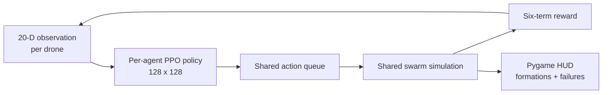

# Swarm Drone Simulation - IAS Project

Interactive 2D swarm simulator with a classical Boids baseline and an
experimental multi-agent PPO control stack.


## Simulation preview


The screenshot is extracted from the matching local formation-demo recording
and shows the actual simulator HUD.

## At a glance

| Verified configuration | Value |
| --- | ---: |
| Classical Boids demonstration | **30 drones** |
| Experimental PPO controllers | **10 agents** |
| Per-agent observation | **20 values** |
| Continuous action | **2 values** |
| Nearest neighbours observed | **3** |
| Maximum episode length | **800 steps** |

## Architecture preview



> **Experimental RL warning:** the current training loop learns one PPO agent at
> a time while the shared simulation advances only after all active agents have
> submitted actions. This creates stale transitions and asymmetric reward timing.
> The saved checkpoints are therefore excluded from the current source tree and
> no trained-performance claim is made.

## Quick start

```bash
python -m pip install -r requirements.txt

# Classical Boids simulation
python main.py

# Experimental RL demo; uses random actions when checkpoints are absent
python demo.py
```

## Legacy presentation notes

**Date:** March 31st, 2026 (Tuesday)  
**Presentation Time:** 5 minutes  
**Q&A:** 2 minutes

---

## PPT Structure (8-10 Slides)

### ✅ 1. Problem Definition & Objectives
- Clearly state the problem and goals of your project
- Highlight its relevance to the IAS (Intelligent Autonomous Systems) course

### ✅ 2. Background & Novelty
- Briefly summarize related works or literature
- Highlight what is new or unique about your approach

### ✅ 3. Proposed Methodology / Approach
- Explain your design, model, or algorithm
- Include a simple block diagram or workflow

### ✅ 4. Hardware Implementation / Simulation Progress
- Present completed work such as hardware working model
- Show code/simulation results

### ✅ 5. Preliminary Results / Validation
- Include initial results and observations
- Discuss challenges faced and how you plan to address them

### ✅ 6. Team Contribution & Next Steps
- Mention each member's contribution
- Outline remaining tasks before the final review

---

## Expectations

- ✅ Teams should show clear progress since the zeroth review (beyond just problem definition)
- ✅ Presentations should be concise, visual, and well-coordinated among members
- ✅ You are expected to demonstrate understanding of your project, not just slides prepared by one member
- ✅ Active participation from all team members will be evaluated

---

## Project Overview

### Swarm Drone Simulation

A Python-based simulation demonstrating swarm intelligence and multi-agent coordination using Pygame.

### Features

- **Multiple Behavior Modes:**
  - `Swarm Mode (Press 1)` - Collective movement towards target
  - `Circle Mode (Press 2)` - Formation in circular pattern around target
  - `Leader Mode (Press 3)` - Leader-follower coordination

- **Swarm Intelligence Algorithms:**
  - Separation - Avoid crowding neighbors
  - Alignment - Steer towards average heading of neighbors
  - Cohesion - Move towards average position of neighbors

- **Additional Features:**
  - Random drone failure simulation
  - Real-time mouse-based target tracking
  - Visual velocity indicators
  - Boundary handling

### Controls

| Key | Action |
|-----|--------|
| `1` | Switch to Swarm Mode |
| `2` | Switch to Circle Mode |
| `3` | Switch to Leader Mode |
| `R` | Reset all drones |
| `F` | Manually fail a random drone |
| Mouse | Set target position |

### Requirements

```
pygame
numpy
```

### How to Run

```bash
pip install pygame numpy
python main.py
```

---

## File Structure

```
IAS_project/
├── main.py          # Main simulation loop and pygame setup
├── drone.py         # Drone class with swarm behaviors
├── utils.py         # Utility functions
├── requirements.txt # Dependencies
└── README.md        # This file
```

---

*Best regards,*  
*Sakthi*
